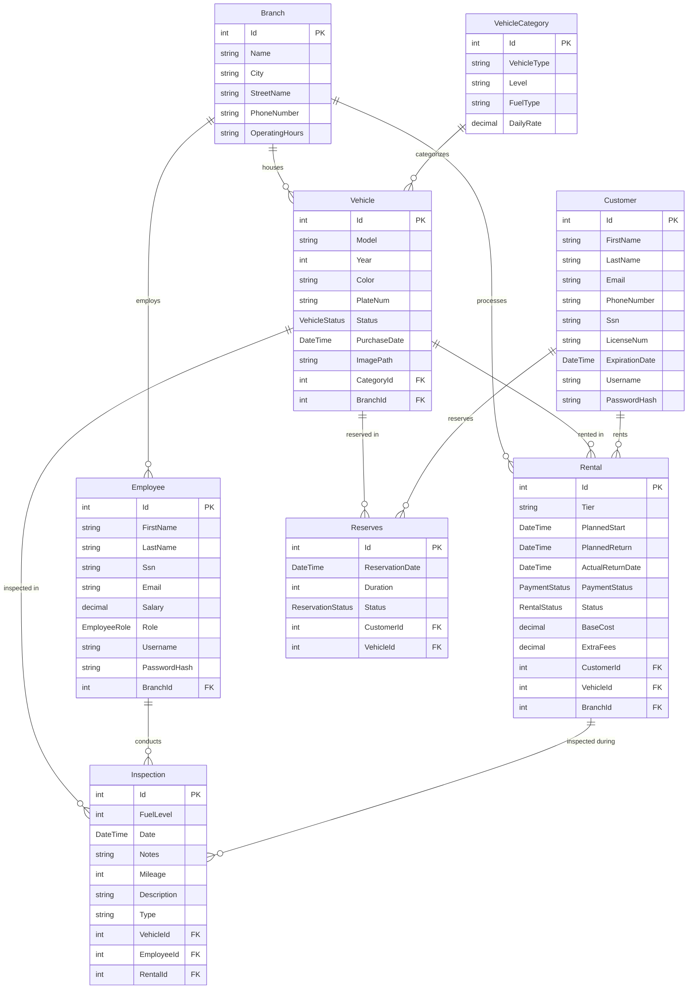

<div align="center">

# 🚗 Tripzy — Car Rental Management System

**A full-featured, enterprise-grade desktop application for managing a multi-branch car rental business.**

Built with **C# · .NET 10 · WinForms · Entity Framework Core · Azure SQL**

[](https://dotnet.microsoft.com/)
[](https://learn.microsoft.com/en-us/dotnet/csharp/)
[](https://learn.microsoft.com/en-us/ef/core/)
[](https://azure.microsoft.com/en-us/products/azure-sql/)
[](LICENSE)

---

</div>

## 📋 Table of Contents

- [Overview](#-overview)
- [Key Features](#-key-features)
- [Architecture](#-architecture)
- [Tech Stack](#-tech-stack)
- [Database Schema](#-database-schema)
- [Project Structure](#-project-structure)
- [Getting Started](#-getting-started)
- [Default Credentials](#-default-credentials)
- [Screenshots](#-screenshots)
- [Contributing](#-contributing)
- [Team](#-team)
- [License](#-license)

---

## 🌟 Overview

**Tripzy** is a comprehensive car rental management system built as a Windows Forms desktop application. It supports the complete rental lifecycle — from customer registration and vehicle search to reservation, payment, and fleet management — across multiple physical branches.

The system implements **role-based access control** with four distinct user roles, each with dedicated dashboards and scoped permissions. It connects to a cloud-hosted **Azure SQL Database**, enabling real-time collaboration across team members and branches.

> **Dual Data Access Layers** — The project showcases two parallel service implementations: one using **Entity Framework Core (LINQ)** for rapid development, and another using **raw ADO.NET (SQL queries)** for fine-grained control. Both are fully functional and interchangeable.

---

## ✨ Key Features

### 👤 Customer Portal
- **Multi-step Registration Wizard** — 3-step flow with form validation, email OTP verification (via Gmail SMTP), and driver's license capture
- **Smart Car Search** — Date-aware availability engine with filters for category, branch, price range, and vehicle tier
- **Reservation & Payment** — Reserve vehicles with computed pricing based on daily rates and rental duration
- **Order Tracking** — Unified view of all rentals and reservations with real-time status indicators
- **Account Management** — Edit personal details, view rental statistics, and securely change passwords

### 🏢 Employee Portal
- **Role-Based Dashboard** — Dynamic UI that adapts based on user role (System Admin / Branch Manager / Rental Agent)
- **Fleet Management** — Create, update, and delete vehicles with branch/category assignment
- **Employee Management** — Admin-only panel to search, add, and remove employees across branches
- **Global Order View** — See the 50 most recent orders system-wide (rentals + reservations)

### 🔒 Security
- **PBKDF2 Password Hashing** — 100,000-iteration salted hashing with SHA-256 (industry standard)
- **Session Management** — Centralized `UserSession` singleton for authentication state
- **Input Validation** — Regex-based validators for email, phone, SSN, driver's license, and password strength
- **Parameterized Queries** — All SQL service implementations use parameterized queries to prevent SQL injection

### ☁️ Cloud & Resilience
- **Azure SQL Integration** — Cloud-hosted database with encrypted TLS connections
- **Automatic Retry Policy** — EF Core configured with 5-retry exponential backoff for transient failures
- **Code-First Migrations** — Schema evolution managed entirely through EF Core migrations
- **Automatic Database Seeding** — Realistic demo data (branches, employees, vehicles, customers, rentals) injected on first run

---

## 🏗 Architecture

```
┌──────────────────────────────────────────────────────┐
│                    PRESENTATION LAYER                 │
│  WinForms (Login, Registration, Dashboards, Search)  │
└─────────────────────┬────────────────────────────────┘
                      │
┌─────────────────────▼────────────────────────────────┐
│                     CORE LAYER                        │
│     UserSession · PasswordHasher · ValidationHelp     │
└─────────────────────┬────────────────────────────────┘
                      │
┌─────────────────────▼────────────────────────────────┐
│                  DTO / TRANSPORT LAYER                 │
│  UserDTO · CarSearchDTO · OrderDTO · CustomerProfile  │
└─────────────────────┬────────────────────────────────┘
                      │
         ┌────────────┴────────────┐
         ▼                         ▼
┌─────────────────┐     ┌─────────────────────┐
│    Services/     │     │    Services_SQL/     │
│  (EF Core LINQ)  │     │  (Raw ADO.NET SQL)   │
│                  │     │                      │
│ AuthService      │     │ AuthService          │
│ CustomerService  │     │ CustomerService      │
│ VehicleService   │     │ VehicleService       │
│ OrderService     │     │ OrderService         │
│ ReservationSvc   │     │ ReservationSvc       │
│ EmpSearchSvc     │     │ EmpSearchSvc         │
└────────┬─────────┘     └──────────┬───────────┘
         │                          │
         └──────────┬───────────────┘
                    ▼
┌──────────────────────────────────────────────────────┐
│                     DATA LAYER                        │
│       AppDbContext · DatabaseSeeder · Migrations      │
└─────────────────────┬────────────────────────────────┘
                      │
                      ▼
              ┌───────────────┐
              │   Azure SQL   │
              │   Database    │
              └───────────────┘
```

---

## 🛠 Tech Stack

| Layer | Technology | Version |
|---|---|---|
| **Language** | C# | 13 |
| **Runtime** | .NET | 10.0 |
| **UI Framework** | Windows Forms (WinForms) | — |
| **ORM** | Entity Framework Core | 10.0.7 |
| **Database** | Azure SQL Server | — |
| **Data Access (Alt)** | ADO.NET / `Microsoft.Data.SqlClient` | — |
| **Configuration** | `Microsoft.Extensions.Configuration` | 10.0.0 |
| **Email** | System.Net.Mail (Gmail SMTP) | — |
| **IDE** | Visual Studio 2022+ | — |
| **Version Control** | Git + GitHub | — |

### NuGet Packages

```xml
Microsoft.EntityFrameworkCore              10.0.7
Microsoft.EntityFrameworkCore.SqlServer    10.0.7
Microsoft.EntityFrameworkCore.Design       10.0.7
Microsoft.EntityFrameworkCore.Tools        10.0.7
Microsoft.Extensions.Configuration         10.0.0
Microsoft.Extensions.Configuration.Json    10.0.0
Microsoft.Extensions.Configuration.Binder  10.0.0
```

---

## 🗄 Database Schema

The system uses a **Code-First** approach with the following entity model:



### Enums

| Enum | Values |
|---|---|
| `EmployeeRole` | `SystemAdmin` · `BranchManager` · `RentalAgent` |
| `VehicleStatus` | `Available` · `Rented` · `Maintenance` · `OutOfService` |
| `RentalStatus` | `Active` · `Completed` · `Overdue` |
| `PaymentStatus` | `Pending` · `Paid` · `Refunded` · `Voided` |
| `ReservationStatus` | `Reserved` · `Cancelled` · `NoShow` · `Overdue` · `Fulfilled` |

---

## 📁 Project Structure

```
CarRentalSystem/
├── CarRentalSystem.slnx              # Solution file
├── global.json                       # .NET SDK version pinning (10.0)
├── README.md
│
└── CarRentalSystem/                  # Main project
    ├── Program.cs                    # Entry point — migrates DB + seeds data + launches Login
    ├── appsettings.json              # Azure SQL connection string (gitignored)
    ├── App.config                    # Gmail SMTP credentials
    ├── CarRentalSystem.csproj        # Project config & NuGet references
    │
    ├── Models/                       # Entity classes (Code-First)
    │   ├── Branch.cs
    │   ├── Customer.cs
    │   ├── Employee.cs
    │   ├── Vehicle.cs
    │   ├── VehicleCategory.cs
    │   ├── Rental.cs
    │   ├── Reserves.cs
    │   ├── Inspection.cs
    │   └── Enums/
    │       ├── EmployeeRole.cs
    │       ├── VehicleStatus.cs
    │       ├── RentalStatus.cs
    │       ├── PaymentStatus.cs
    │       └── ReservationStatus.cs
    │
    ├── Data/                         # Database context & seeder
    │   ├── AppDbContext.cs            # EF Core DbContext with retry policy
    │   └── DatabaseSeeder.cs          # Seed data for demo/testing
    │
    ├── DTOs/                         # Data Transfer Objects
    │   ├── UserDTO.cs                 # Unified login result (Employee + Customer)
    │   ├── CarSearchDTO.cs            # Flattened vehicle search result
    │   ├── OrderDTO.cs                # Combined rental/reservation order view
    │   ├── CustomerProfileDTO.cs      # Profile with rental statistics
    │   ├── RegistrationDTO.cs         # Multi-step registration payload
    │   └── employeeDTO.cs             # Employee list/search result
    │
    ├── Core/                         # Shared utilities
    │   ├── PasswordHasher.cs          # PBKDF2 (100K iterations, SHA-256)
    │   ├── UserSession.cs             # Static session singleton
    │   └── ValidationHelp.cs          # Regex patterns for input validation
    │
    ├── Services/                     # Business logic (EF Core / LINQ)
    │   ├── AuthService.cs
    │   ├── CustomerService.cs
    │   ├── VehicleService.cs
    │   ├── OrderService.cs
    │   ├── ReservationService.cs
    │   └── EmpSearchService.cs
    │
    ├── Services_SQL/                 # Business logic (Raw ADO.NET / SQL)
    │   ├── AuthService.cs
    │   ├── CustomerService.cs
    │   ├── VehicleService.cs
    │   ├── OrderService.cs
    │   ├── ReservationService.cs
    │   └── EmpSearchService.cs
    │
    ├── Forms/                        # WinForms UI
    │   ├── Login_Page.cs              # Authentication entry point
    │   ├── Register_Page.cs           # Step 1: Basic info + validation
    │   ├── Email_Verification.cs      # Step 2: OTP via Gmail SMTP
    │   ├── Final_Registration.cs      # Step 3: License & identity details
    │   ├── Customer_Dashboard.cs      # Customer home screen
    │   ├── Employee_Dashboard.cs      # Employee/Admin home screen
    │   ├── Customer_Car_Search.cs     # Date-aware vehicle search + filters
    │   ├── CarCardControl.cs          # Reusable car result card (UserControl)
    │   ├── Car_View.cs                # Vehicle detail view
    │   ├── Reservation_Payment.cs     # Payment confirmation + DB commit
    │   ├── Order_View.cs              # Order history list
    │   ├── OrderCardControl.cs        # Reusable order card (UserControl)
    │   ├── Account_Information.cs     # Profile view/edit with stats
    │   ├── Change_Password.cs         # Secure password update
    │   ├── Create_vehicle.cs          # Create/Manage vehicle (dual-mode form)
    │   ├── employeeCarSearch.cs       # Employee vehicle search (with CRUD)
    │   ├── employeeSearch.cs          # Employee management panel
    │   └── AddEmployee.cs             # Add new employee form
    │
    ├── Migrations/                   # EF Core migration history
    ├── Resources/                    # Icons, logos, UI assets
    └── images/                       # Vehicle brand images (BMW, Toyota, etc.)
```

---

## 🚀 Getting Started

### Prerequisites

- [.NET 10 SDK](https://dotnet.microsoft.com/en-us/download/dotnet/10.0) or later
- [Visual Studio 2022](https://visualstudio.microsoft.com/) (with **.NET desktop development** workload)
- Access to the shared Azure SQL database (or your own SQL Server instance)

### Setup

1. **Clone the repository**
   ```bash
   git clone https://github.com/OMZaky/CarRentalSystem.git
   cd CarRentalSystem
   ```

2. **Configure the database connection**
   
   Create or update the `appsettings.json` file inside the `CarRentalSystem/` project folder:
   ```json
   {
     "ConnectionStrings": {
       "AzureDbConnection": "Server=tcp:<your-server>.database.windows.net,1433;Initial Catalog=CarRentalSystem;User ID=<your-user>;Password=<your-password>;Encrypt=True;TrustServerCertificate=False;Connection Timeout=30;"
     }
   }
   ```
   > ⚠️ **Note:** `appsettings.json` is listed in `.gitignore`. Never commit credentials to version control.

3. **Configure email verification (optional)**
   
   Update `App.config` with your Gmail App Password for OTP functionality:
   ```xml
   <appSettings>
     <add key="GmailAddress" value="your_email@gmail.com"/>
     <add key="GmailAppPassword" value="your-16-char-app-password"/>
   </appSettings>
   ```
   > 💡 Generate an App Password at [Google Account → Security → App Passwords](https://myaccount.google.com/apppasswords).

4. **Apply database migrations**
   
   Open the **Package Manager Console** in Visual Studio and run:
   ```powershell
   Update-Database
   ```
   Alternatively, the app automatically runs `context.Database.Migrate()` on startup.

5. **Run the application**
   
   Press `F5` in Visual Studio or run:
   ```bash
   dotnet run --project CarRentalSystem
   ```
   On first launch, the database seeder will populate demo data automatically.

---

## 🔑 Default Credentials

The database seeder creates the following accounts for testing:

### Employees

| Role | Username | Password |
|---|---|---|
| System Admin | `admin_zaky` | `AdminPass123!` |
| Branch Manager | `mgr_esraa` | `ManagerPass123!` |
| Rental Agent | `agent_omar` | `AgentPass123!` |
| Rental Agent | `agent_shahd` | `AgentPass123!` |

### Customers

| Username | Password |
|---|---|
| `karim_h` | `CustPass123!` |
| `nouribrahim` | `CustPass123!` |
| `youssef_k` | `CustPass123!` |

---

## 📸 Screenshots

> *Screenshots coming soon — contributions welcome!*

<!-- 
Add screenshots of your UI here. Example:
| Login Page | Customer Dashboard | Car Search |
|---|---|---|
|  |  |  |
-->

---

## 🤝 Contributing

1. **Fork** the repository
2. **Create** a feature branch (`git checkout -b feature/my-feature`)
3. **Commit** your changes (`git commit -m "Add my feature"`)
4. **Push** to the branch (`git push origin feature/my-feature`)
5. Open a **Pull Request**

Please ensure your code follows the existing project conventions and includes appropriate error handling.

---

## 👥 Team

| Contributor | GitHub |
|---|---|
| **Omar Zaky** | [@OMZaky](https://github.com/OMZaky) |
| **Omar Akram** | [@OmarAK2005](https://github.com/OmarAK2005) |
| **Omar Ayman** | [@OmarAyman33](https://github.com/OmarAyman33) |
| **Mohamed Osama** | [@osama1705](https://github.com/osama1705) |
| **Omar Mohamed** | [@omar887](https://github.com/omar887) |

---

## 📄 License

This project is licensed under the **MIT License** — see the [LICENSE](https://github.com/twbs/bootstrap/blob/main/LICENSE) file for details.

---

<div align="center">

**Built with ❤️ using C# and .NET 10**

</div>
